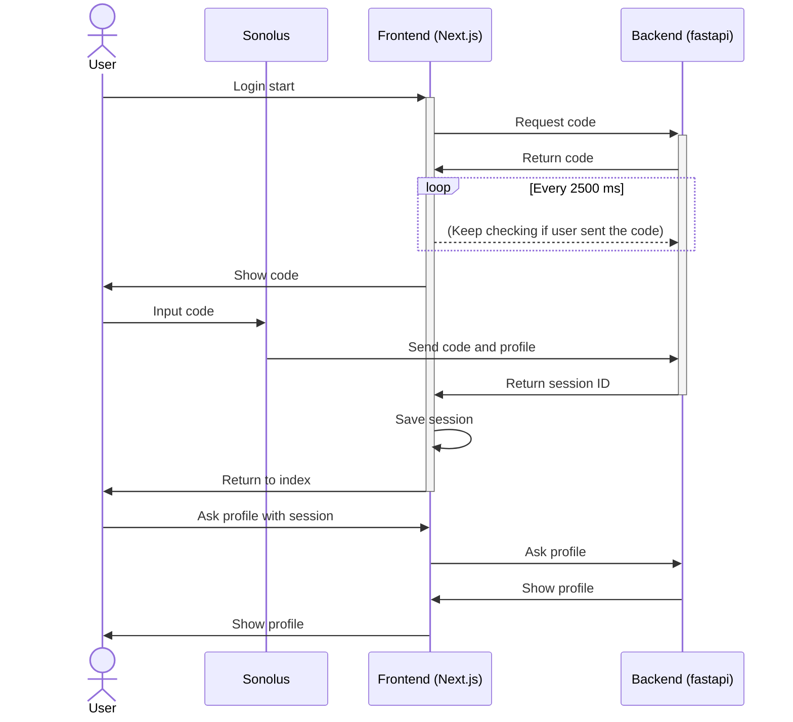

# sonolus-login-poc

PoC for implementing "Login with Sonolus"

## How does it work?

```mermaid
sequenceDiagram
    actor u as User
    participant s as Sonolus
    participant f as Frontend (Next.js)
    participant b as Backend (fastapi)
    u->>+f: Login start
    f->>+b: Request code
    b->>f: Return code
    loop Every 2500 ms
        f-->>b: (Keep checking if user sent the code)
    end
    f->>u: Show code
    u->>s: Input code
    s->>b: Send code and profile
    b->>-f: Return session ID
    f->>f: Save session
    f->>-u: Return to index
    u->>f: Ask profile with session
    f->>b: Ask profile
    b->>f: Show profile
    f->>u: Show profile
```

## License

MIT License

